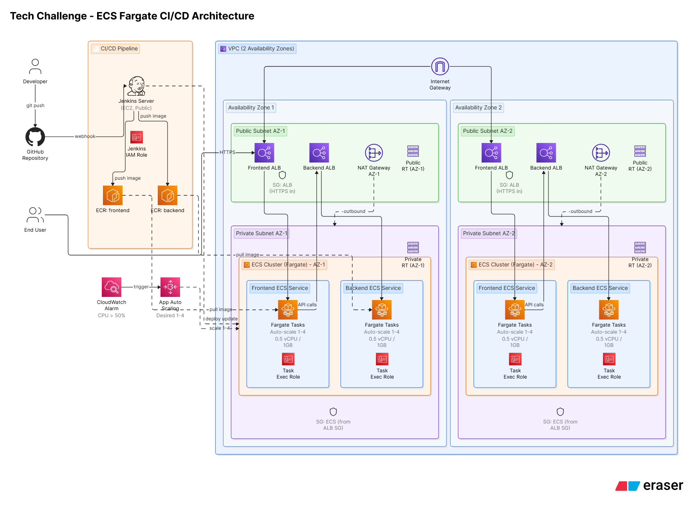
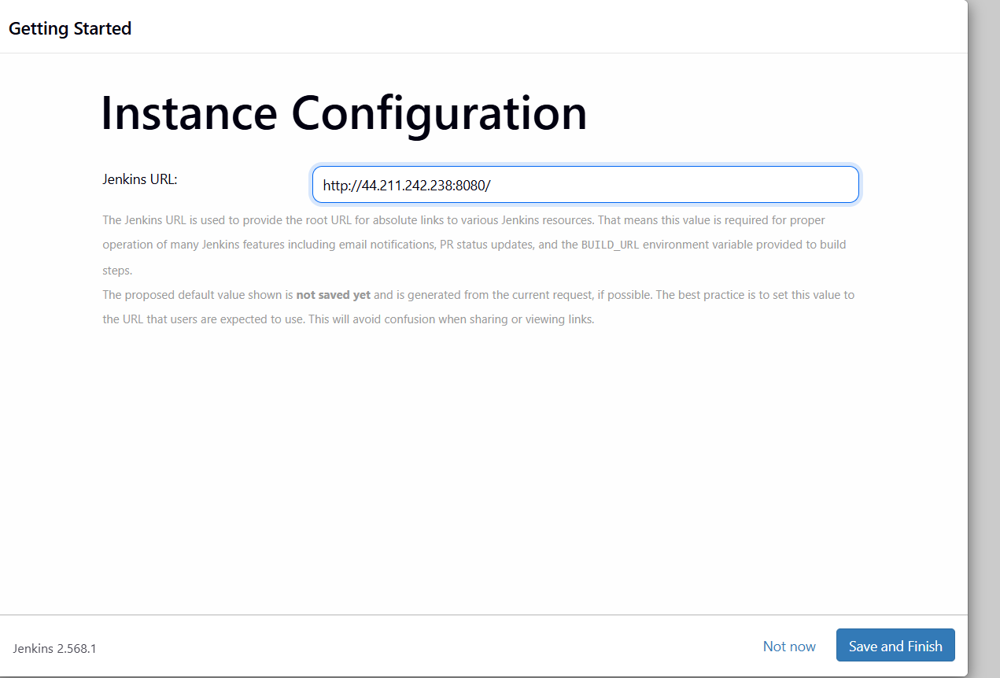

# Tech Challenge — ECS Fargate CI/CD Architecture

A full DevOps pipeline deploying a React frontend and Express backend to AWS using Docker, Terraform, ECS Fargate, and Jenkins CI/CD — provisioned end-to-end as Infrastructure as Code with automated build/deploy on every push.

## Architecture Diagram



*(See `/docs` folder for the full-resolution diagram)*

**Stack:** React (frontend) + Express (backend) → Docker → Amazon ECR → Amazon ECS Fargate (multi-AZ) behind two Application Load Balancers, provisioned with Terraform, deployed automatically via a Jenkins pipeline triggered by GitHub webhooks.

---

## Live Demo (may no longer be active)

- **Frontend:** http://tech-challenge-1-frontend-alb-1880709313.us-east-1.elb.amazonaws.com
- **Jenkins:** http://44.211.242.238:8080

> Note: this infrastructure is deployed/destroyed as needed to control AWS cost. If the links above are down, follow the steps below to redeploy the entire stack in ~20–30 minutes.

---

## Getting Started — Clone This Repo

This repo is public, so you can either **fork** it (if you plan to make your own changes and want your own copy under your GitHub account) or just **clone** it directly (if you only want to run/test it locally).

**Option A — Clone directly (simplest):**
```bash
git clone https://github.com/ReadyProgramReen/Tech-Challenge--ECS-Fargate-CI-CD-Architecture.git
cd Tech-Challenge--ECS-Fargate-CI-CD-Architecture
```

**Option B — Fork first (if you want your own copy):**
1. Click **"Fork"** at the top right of this repo's GitHub page
2. Clone your fork:
```bash
git clone https://github.com//Tech-Challenge--ECS-Fargate-CI-CD-Architecture.git
cd Tech-Challenge--ECS-Fargate-CI-CD-Architecture
```

Once cloned, continue with **Prerequisites** below.

---

## Prerequisites

Before starting, install the following:

| Tool | Version | Purpose |
|---|---|---|
| [Git](https://git-scm.com/) | any recent | version control |
| [Node.js](https://nodejs.org/) | v16.x (via [nvm](https://github.com/nvm-sh/nvm) recommended) | matches the app's tested version |
| [Docker](https://docs.docker.com/engine/install/) | any recent | containerization |
| [Terraform](https://developer.hashicorp.com/terraform/install) | v1.0+ | infrastructure as code |
| [AWS CLI v2](https://docs.aws.amazon.com/cli/latest/userguide/getting-started-install.html) | v2.x | AWS resource management |

You'll also need:
- An AWS account with an **IAM user** (not root) that has permissions for VPC, ECS, ECR, IAM, EC2, ELB, CloudWatch, and Application Auto Scaling
- AWS CLI configured locally: `aws configure` (or run `aws sts get-caller-identity` to confirm it's already set up)

---

## Repository Structure
.
├── backend/              # Express API (returns a GUID)
│   ├── Dockerfile
│   ├── .dockerignore
│   ├── index.js
│   └── config.js         # CORS_ORIGIN — must match frontend ALB URL
├── frontend/              # React app (Create React App)
│   ├── Dockerfile         # multi-stage build → served via nginx
│   ├── .dockerignore
│   └── src/config.js      # API_URL — must match backend ALB URL
├── terraform/              # All application infrastructure (IaC)
│   ├── provider.tf
│   ├── variables.tf
│   ├── terraform.tfvars
│   ├── vpc.tf              # VPC, subnets, NAT gateways, route tables
│   ├── security_groups.tf
│   ├── ecr.tf
│   ├── iam.tf
│   ├── alb.tf
│   ├── ecs.tf
│   ├── autoscaling.tf
│   └── outputs.tf
├── docs/                    # Architecture diagram & screenshots
├── Jenkinsfile              # CI/CD pipeline definition
└── README.md

**A note on `terraform.tfvars` being committed:** normally `.tfvars` files are excluded from version control since they can hold secrets. This project's `.tfvars` only contains non-sensitive config (AWS region, project name prefix), so it's intentionally committed here to let anyone clone and `terraform apply` immediately without guessing values.

---

## Part 1 — Run the App Locally (no AWS needed)

Install dependencies with `npm ci` (this reads the existing `package-lock.json` and installs the exact dependency versions the app was built/tested with — don't run `npm init`, which would instead create a brand-new, empty `package.json` and overwrite the existing one):

```bash
# Backend
cd backend
npm ci
npm start
# → listening on localhost:8080

# In a new terminal — Frontend
cd frontend
npm ci
npm start
# → opens localhost:3000, should show a green SUCCESS message + GUID
```

---

## Part 2 — Run with Docker Locally

```bash
# Backend
cd backend
docker build -t backend:local .
docker run -d -p 8080:8080 --name backend-test backend:local

# Frontend
cd frontend
docker build -t frontend:local .
docker run -d -p 3000:80 --name frontend-test frontend:local
```

Visit `localhost:3000` — same SUCCESS message should appear, now running fully containerized.

Clean up when done:
```bash
docker stop backend-test frontend-test
docker rm backend-test frontend-test
```

---

## Part 3 — Deploy AWS Infrastructure with Terraform

1. Confirm AWS CLI is authenticated:
```bash
aws sts get-caller-identity
```

2. Initialize and apply Terraform:
```bash
cd terraform
terraform init
terraform apply
```
Type `yes` when prompted. This provisions (in order): VPC + multi-AZ subnets + NAT gateways → security groups → ECR repos → IAM roles → Application Load Balancers → ECS cluster/services → CPU-based auto-scaling policies (1–4 tasks, 50% CPU target, 0.5 vCPU / 1GB per task).

3. Note the outputs — you'll need these next:
```bash
terraform output
```
Specifically `ecr_frontend_repo_url`, `ecr_backend_repo_url`, `frontend_alb_dns`, `backend_alb_dns`.

**Cost note:** this stack includes 2 NAT Gateways (~$0.09/hr combined) and 2 ALBs (~$0.045/hr combined) — run `terraform destroy` when not actively using it (see Part 8).

---

## Part 4 — Point the App at Your ALBs and Push Images to ECR

1. Update `frontend/src/config.js`:
```js
export const API_URL = 'http://<your-backend-alb-dns>/'
export default API_URL
```

2. Update `backend/config.js`:
```js
module.exports = {
    CORS_ORIGIN: 'http://<your-frontend-alb-dns>'
}
```

3. Authenticate Docker to ECR and push both images:
```bash
aws ecr get-login-password --region us-east-1 | docker login --username AWS --password-stdin <account-id>.dkr.ecr.us-east-1.amazonaws.com

docker build -t backend:local ./backend
docker tag backend:local <ecr_backend_repo_url>:latest
docker push <ecr_backend_repo_url>:latest

docker build -t frontend:local ./frontend
docker tag frontend:local <ecr_frontend_repo_url>:latest
docker push <ecr_frontend_repo_url>:latest
```

4. ECS will need a fresh deployment to pick up the new images:
```bash
aws ecs update-service --cluster tech-challenge-1-cluster --service tech-challenge-1-frontend-service --force-new-deployment
aws ecs update-service --cluster tech-challenge-1-cluster --service tech-challenge-1-backend-service --force-new-deployment
```

5. Visit the frontend ALB DNS in your browser — you should see the SUCCESS message.

---

## Part 5 — Deploy Jenkins (Manual, per challenge rules)

Per the assignment rules, Jenkins infrastructure is provisioned manually (not Terraform), documented here instead.

**Jenkins infrastructure components:**
- **EC2 instance:** `t3.micro`, Ubuntu Server 26.04 LTS, in a public subnet from the Terraform-created VPC
- **Security group:** inbound TCP 22 (SSH) and TCP 8080 (Jenkins UI) from `0.0.0.0/0`
- **IAM role (instance profile):** `jenkins-ec2-role` with `AmazonEC2ContainerRegistryFullAccess` and `AmazonECS_FullAccess` attached — lets Jenkins push to ECR and update ECS without storing AWS keys
- **Jenkins runtime:** runs as a Docker container (`jenkins/jenkins:lts`), extended with a custom image adding Docker CLI + AWS CLI so pipeline stages can build/push images and call AWS directly

### Steps to recreate:

```bash
# 1. Create a key pair (store outside any git repo)
aws ec2 create-key-pair --key-name jenkins-key --query 'KeyMaterial' --output text > ~/jenkins-key.pem
chmod 400 ~/jenkins-key.pem

# 2. Create a security group
aws ec2 create-security-group --group-name jenkins-sg --description "Jenkins SG" --vpc-id <your-vpc-id>
aws ec2 authorize-security-group-ingress --group-id <sg-id> --protocol tcp --port 22 --cidr 0.0.0.0/0
aws ec2 authorize-security-group-ingress --group-id <sg-id> --protocol tcp --port 8080 --cidr 0.0.0.0/0

# 3. Launch the instance (Ubuntu 26.04 AMI — find current AMI ID for your region via AWS Console)
aws ec2 run-instances \
  --image-id <ubuntu-ami-id> \
  --instance-type t3.micro \
  --key-name jenkins-key \
  --security-group-ids <sg-id> \
  --subnet-id <public-subnet-id> \
  --associate-public-ip-address \
  --user-data file://jenkins-userdata.sh
```

`jenkins-userdata.sh` installs Docker and starts Jenkins as a container on first boot (see script pattern in the Dockerfile section below).

```bash
# 4. Create and attach an IAM role so Jenkins can reach AWS
aws iam create-role --role-name jenkins-ec2-role --assume-role-policy-document file://ec2-trust-policy.json
aws iam attach-role-policy --role-name jenkins-ec2-role --policy-arn arn:aws:iam::aws:policy/AmazonEC2ContainerRegistryFullAccess
aws iam attach-role-policy --role-name jenkins-ec2-role --policy-arn arn:aws:iam::aws:policy/AmazonECS_FullAccess
aws iam create-instance-profile --instance-profile-name jenkins-ec2-profile
aws iam add-role-to-instance-profile --instance-profile-name jenkins-ec2-profile --role-name jenkins-ec2-role
aws ec2 associate-iam-instance-profile --instance-id <instance-id> --iam-instance-profile Name=jenkins-ec2-profile
```

```bash
# 5. SSH in, retrieve the initial admin password, and unlock Jenkins in the browser
ssh -i ~/jenkins-key.pem ubuntu@<public-ip>
sudo docker exec jenkins cat /var/jenkins_home/secrets/initialAdminPassword
```

Visit `http://<public-ip>:8080`, paste the password, install suggested plugins, and create your admin account. Once complete, you'll land on the **Instance Configuration** screen confirming your Jenkins URL:



### Rebuild Jenkins with Docker + AWS CLI support

The default Jenkins image can't build Docker images or call AWS. A custom image adds both:

```dockerfile
FROM jenkins/jenkins:lts
USER root
RUN apt-get update && apt-get install -y ca-certificates curl gnupg unzip lsb-release && \
    curl -fsSL https://download.docker.com/linux/debian/gpg | gpg --dearmor -o /usr/share/keyrings/docker-archive-keyring.gpg && \
    echo "deb [arch=$(dpkg --print-architecture) signed-by=/usr/share/keyrings/docker-archive-keyring.gpg] https://download.docker.com/linux/debian $(lsb_release -cs) stable" | tee /etc/apt/sources.list.d/docker.list > /dev/null && \
    apt-get update && apt-get install -y docker-ce-cli && \
    curl "https://awscli.amazonaws.com/awscli-exe-linux-x86_64.zip" -o "awscliv2.zip" && \
    unzip awscliv2.zip && ./aws/install && rm -rf awscliv2.zip aws/
USER jenkins
```

```bash
sudo docker build -t jenkins-custom:latest .
sudo docker stop jenkins && sudo docker rm jenkins

# Find the host's docker group GID (needed for socket permissions)
getent group docker

sudo docker run -d \
  --name jenkins \
  -p 8080:8080 -p 50000:50000 \
  -v jenkins_home:/var/jenkins_home \
  -v /var/run/docker.sock:/var/run/docker.sock \
  --group-add <docker-gid-from-above> \
  --restart unless-stopped \
  jenkins-custom:latest
```

> **Known issue:** the default `t3.micro` (1GB RAM, 8GB disk) can run out of memory/disk during the first React build. If builds fail or Jenkins restarts mid-build, resize the EBS volume to 16GB (`aws ec2 modify-volume --volume-id <id> --size 16`, then `sudo growpart` + `sudo resize2fs` on the instance) and add a 1GB swapfile.

---

## Part 6 — Configure the Jenkins Pipeline

1. **New Item** → name it, select **Pipeline** → OK
2. Under **Pipeline** section: **Definition** → "Pipeline script from SCM" → **SCM**: Git → your repo URL → **Branch**: `*/main` → **Script Path**: `Jenkinsfile`
3. If your repo is private, add credentials (Username + GitHub Personal Access Token) via the **Add** button next to Credentials
4. Under **Build Triggers**: check "GitHub hook trigger for GITScm polling"
5. Save, then **Build Now** to test manually

### GitHub Webhook (auto-trigger on push)
1. Repo → **Settings → Webhooks → Add webhook**
2. Payload URL: `http://<jenkins-public-ip>:8080/github-webhook/`
3. Content type: `application/json`, events: "Just the push event"
4. Save — GitHub sends a test ping; check "Recent Deliveries" for a green checkmark

From here, every push to `main` triggers: checkout → build both images → push to ECR → force-redeploy both ECS services.

---

## Part 7 — Load Testing & Auto Scaling

```bash
# Install a load testing tool
sudo apt install siege -y

# Watch service task count live in a second terminal
watch -n 10 'aws ecs describe-services --cluster tech-challenge-1-cluster --services tech-challenge-1-backend-service --query "services[0].{running:runningCount,desired:desiredCount}"'

# Generate load
siege -c 500 -t 8M http://<backend-alb-dns>
```

Check CPU utilization directly via CloudWatch:
```bash
aws cloudwatch get-metric-statistics \
  --namespace AWS/ECS --metric-name CPUUtilization \
  --dimensions Name=ClusterName,Value=tech-challenge-1-cluster Name=ServiceName,Value=tech-challenge-1-backend-service \
  --start-time <ISO-timestamp> --end-time <ISO-timestamp> --period 60 \
  --statistics Average Maximum --output table
```

> **Result:** load testing (up to 500 concurrent connections against the backend) drove CPU utilization to ~16–18%, confirming CloudWatch metrics and the target-tracking auto-scaling policy are correctly wired and actively monitoring the service. Sustained load beyond the 50% threshold would trigger scale-out from 1 up to the configured maximum of 4 tasks, per `terraform/autoscaling.tf`.

---

## Part 8 — Tear Down

To avoid ongoing AWS charges:

```bash
# Destroy all Terraform-managed infrastructure
cd terraform
terraform destroy

# Manually terminate the Jenkins EC2 instance
aws ec2 terminate-instances --instance-ids <instance-id>

# Clean up the manually created IAM role/profile and security group
aws ec2 disassociate-iam-instance-profile --association-id <assoc-id>
aws iam remove-role-from-instance-profile --instance-profile-name jenkins-ec2-profile --role-name jenkins-ec2-role
aws iam delete-instance-profile --instance-profile-name jenkins-ec2-profile
aws iam detach-role-policy --role-name jenkins-ec2-role --policy-arn arn:aws:iam::aws:policy/AmazonEC2ContainerRegistryFullAccess
aws iam detach-role-policy --role-name jenkins-ec2-role --policy-arn arn:aws:iam::aws:policy/AmazonECS_FullAccess
aws iam delete-role --role-name jenkins-ec2-role
aws ec2 delete-security-group --group-id <jenkins-sg-id>
aws ec2 delete-key-pair --key-name jenkins-key
```

---

## Requirements Checklist

- ✅ Jenkins deployed on AWS, publicly accessible
- ✅ Frontend + backend deployed to ECS Fargate, frontend publicly accessible
- ✅ Deployment automated via Jenkins pipeline (Jenkinsfile), triggered by GitHub webhook
- ✅ All application infrastructure provisioned via Terraform
- ✅ ECS: Fargate launch type, 0.5 vCPU / 1GB per task, min 1 / desired 1 / max 4, auto-scale trigger at 50% CPU
- ✅ Jenkins infrastructure created manually, documented above
- ✅ Dockerized frontend and backend